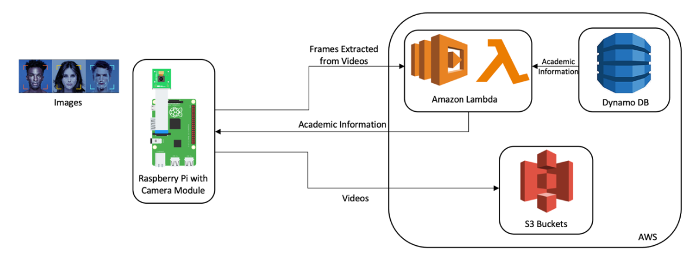

# Platform as a Service - Image Recognition
Cloud application which provides Real-Time Face Recognition as a Service to the users by using the resources of the AWS cloud - Lambda, DynamoDB and S3 and IoT device (Raspberry Pi) at the edge

## Architecture

## Edge
The edge component is based on the Raspberry Pi. It has a camera module that is used to record the videos and the videos are stored on Amazon S3. The frames are extracted from the videos and sent to the cloud.

## Cloud
The cloud (AWS) hosts the docker image with the trained face recognition deep-learning model. It processes the frames on Amazon Lambda and recognizes the face. The academic information of the recognized student is fetched from DynamoDB, where it is already stored. This data is sent back to the Pi as the response.

## Steps to Run the Code on Raspberry Pi
1. Install python3 on the Raspberry Pi
2. Use pip install to install cv2 and boto3 libraries
3. Execute the code rt_face_recognition.py by running the command - 'python3 rt_face_recognition.py'
4. The results of the recognized faces are displayed on the terminal

## Steps to Run the Code on Lambda
1. Include the handler.py, eval_face_recognition.py and the trained models while creating the docker image
2. Create a Lambda function using the docker image
3. Deploy the function

